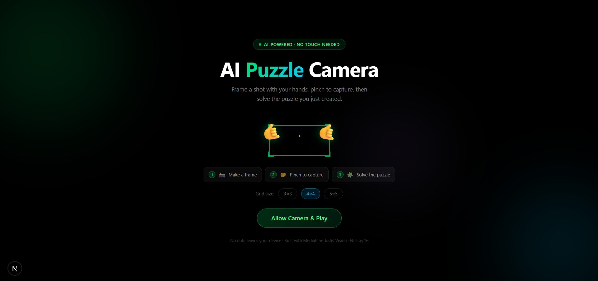
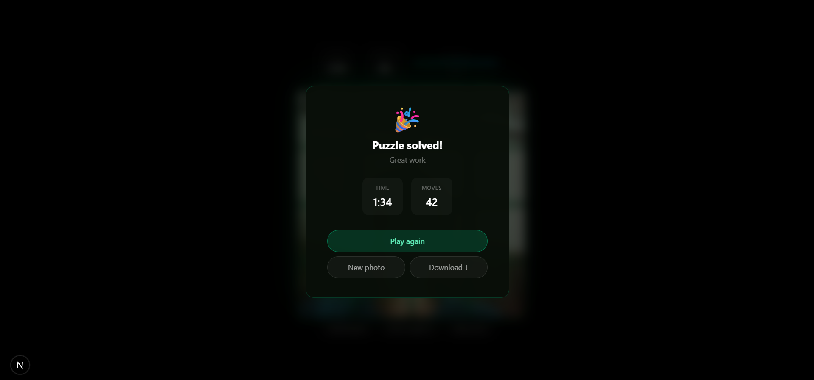

<div align="center">

<br />


```
            ░█████╗░██╗    ██████╗░██╗░░░██╗███████╗███████╗██╗░░░░░███████╗
            ██╔══██╗██║    ██╔══██╗██║░░░██║╚════██║╚════██║██║░░░░░██╔════╝
            ███████║██║    ██████╔╝██║░░░██║░░███╔═╝░░███╔═╝██║░░░░░█████╗░░
            ██╔══██║██║    ██╔═══╝░██║░░░██║██╔══╝░░██╔══╝░░██║░░░░░██╔══╝░░
            ██║░░██║██║    ██║░░░░░╚██████╔╝███████╗███████╗███████╗███████╗
            ╚═╝░░╚═╝╚═╝    ╚═╝░░░░░░╚═════╝░╚══════╝╚══════╝╚══════╝╚══════╝
```

### **Turn your webcam into an AI-powered puzzle game - using only your hands.**

<p align="center">

## 🚀 Live Demo

**Try it here:**

https://puzzle-cam-navy.vercel.app/

> Allow camera permission and use two hands to create a frame.

</p>

<br />


<br />

</div>

---
## 📸 Preview


|  |  |

---

## ✨ How It Works

```
📷 Webcam  →  🤖 AI Hand Tracking  →  🖼️ Frame Gesture  →  📸 Pinch Capture  →  🧩 Solve Puzzle
```

| Step | Action | Magic |
|------|--------|-------|
| 1 | Open the app | Camera starts automatically |
| 2 | Raise both hands | AI detects all 21 landmarks per hand in real time |
| 3 | Form a rectangle | Thumbs + index fingers define the frame corners |
| 4 | Hold for 0.5s | Frame glows green — **Ready!** |
| 5 | Pinch fingers | Camera flashes and captures the frame |
| 6 | Drag the pieces | Solve the puzzle you just created |
| 7 | 🎉 | Confetti and win screen |

---

## ⚡ Performance

- ~30 FPS hand tracking
- Single requestAnimationFrame render loop
- Zero unnecessary React re-renders during tracking
- Canvas-based rendering for overlays
- MediaPipe HandLandmarker initialized only once
- Puzzle pieces generated once and rendered as image elements

---

## 🎯 Features

- **Real-time hand tracking** at 30 FPS via MediaPipe Tasks Vision
- **Smoothed frame detection** using an 8-frame moving average (no jitter)
- **3×3, 4×4, or 5×5** puzzle grids
- **Drag and drop** puzzle with snap animations via dnd-kit
- **Hold to peek** — see the reference image while solving
- **Download** your captured image
- **Dark glassmorphism UI** — Apple × Linear × Vercel aesthetic
- **Fully client-side** — no data ever leaves your device

---

## 🛠️ Tech Stack

```
Frontend       →  Next.js 16 · React 19 · TypeScript · Tailwind CSS 4
Animations     →  Framer Motion 12
Hand Tracking  →  @mediapipe/tasks-vision (HandLandmarker, VIDEO mode)
Drag & Drop    →  @dnd-kit/core · @dnd-kit/sortable
Rendering      →  HTML5 Canvas · requestAnimationFrame
```

---

## 🚀 Getting Started

### Prerequisites

- Node.js 18+
- A webcam
- A modern Chromium-based browser (Chrome / Edge)

### Installation

```bash
# Clone the repository
git clone https://github.com/miralhsn/PuzzleCam.git
cd PuzzleCam

# Install dependencies
npm install

# Copy MediaPipe WASM files to public
mkdir -p public/wasm
cp node_modules/@mediapipe/tasks-vision/wasm/* public/wasm/

# Start the development server
npm run dev
```

Open [http://localhost:3000](http://localhost:3000) and allow camera access.

> **Note:** > The MediaPipe model is downloaded from Google's storage on first use, while the WebAssembly runtime is served locally from `/public/wasm` for improved reliability and faster startup.

---
## 🌍 Browser Support

| Browser | Supported |
|----------|-----------|
| Chrome | ✅ |
| Edge | ✅ |
| Brave | ✅ |
| Firefox | ⚠️ Limited |
| Safari | ⚠️ Experimental |

---

## 📁 Project Structure

```
PuzzleCam/
├── app/
│   ├── components/
│   │   ├── camera/
│   │   │   ├── CameraView.tsx        # Main camera + rAF render loop
│   │   │   ├── CameraFlash.tsx       # Capture flash animation
│   │   │   ├── FingerFrameOverlay.tsx # "Ready" badge animation
│   │   │   └── HUD.tsx               # FPS, hand status, grid selector
│   │   ├── puzzle/
│   │   │   ├── PuzzleScreen.tsx      # Game state, timer, moves
│   │   │   ├── PuzzleBoard.tsx       # dnd-kit sortable grid
│   │   │   └── PuzzlePiece.tsx       # Individual draggable piece
│   │   └── ui/
│   │       ├── PermissionScreen.tsx  # Camera permission gate
│   │       ├── WinModal.tsx          # Completion modal
│   │       └── Confetti.tsx          # Canvas confetti burst
│   ├── hooks/
│   │   ├── useCamera.ts              # MediaStream lifecycle
│   │   ├── useHandTracking.ts        # HandLandmarker singleton
│   │   └── useGestureDetection.ts    # Frame rect + pinch logic
│   ├── lib/
│   │   ├── capture.ts                # Webcam frame capture
│   │   ├── geometry.ts               # Canvas drawing utilities
│   │   └── puzzle.ts                 # Puzzle generation + solver
│   ├── utils/
│   │   ├── math.ts                   # Timer formatting
│   │   └── shuffle.ts                # Fisher-Yates shuffle
│   └── types/
│       └── index.ts                  # Shared TypeScript types
└── public/
    └── wasm/                         # MediaPipe WASM runtime (local)
```

---

## 🏗️ Architecture

```text
Camera
   │
   ▼
MediaStream
   │
   ▼
HandLandmarker
   │
   ▼
Gesture Detection
   │
   ├────────────► Frame Detection
   │
   └────────────► Pinch Detection
                     │
                     ▼
               Capture Image
                     │
                     ▼
               Puzzle Generator
                     │
                     ▼
              Drag & Drop Puzzle
```
---

## 🎨 Gesture Detection

```
Both hands visible
        ↓
Thumb tip (landmark 4) + Index tip (landmark 8) × 2 hands = 4 points
        ↓
8-frame moving average smoothing
        ↓
Bounding rect from min/max of mirrored canvas coordinates
        ↓
Stability check: rect held for 500ms → glows green
        ↓
Pinch: distance(thumb, index) < 32px → capture (2s cooldown)
```

---

## 📸 Capture Pipeline

```
Pinch detected
      ↓
captureFrame(video)         → drawImage with horizontal mirror
      ↓
createPuzzle(dataUrl, N)    → slice into N×N canvas tiles
      ↓
shuffleGuaranteed(pieces)   → Fisher-Yates (never identity permutation)
      ↓
PuzzleBoard renders         → dnd-kit sortable grid
      ↓
isSolved check after each move → confetti + win modal
```

---

## 🔧 Configuration

Change grid size via the selector below the camera (3×3, 4×4, 5×5).

To adjust gesture sensitivity, edit `app/hooks/useGestureDetection.ts`:

```ts
const SMOOTH_WINDOW      = 8;    // frames to average (higher = smoother)
const STABLE_MS          = 500;  // ms frame must be held before "Ready"
const PINCH_THRESHOLD_PX = 32;   // pixels between thumb+index for pinch
const PINCH_COOLDOWN_MS  = 2000; // cooldown between captures
```

---

## 💡 Why I Built This

I wanted to explore gesture-driven interfaces beyond traditional button-based interactions.

This project combines real-time computer vision, MediaPipe hand tracking, HTML5 Canvas rendering, and drag-and-drop interactions into a complete browser game where the user's hands become the primary input device.

The goal was to build an experience that feels natural while maintaining high rendering performance and clean architecture.

---

## ⚙️ Engineering Challenges

Some interesting engineering problems solved during development:

- React 19 StrictMode causing duplicate MediaPipe initialization
- Keeping rendering above 30 FPS while processing hand landmarks every frame
- Eliminating gesture jitter using temporal smoothing
- Synchronizing mirrored video with non-mirrored landmark coordinates
- Preventing unnecessary React renders by keeping the animation loop outside React state
- Building a stable gesture pipeline using requestAnimationFrame

---

## 🚀 Future Improvements

- Multiplayer puzzle races
- Difficulty modes
- Gesture customization
- Mobile optimization
- Leaderboard
- Timed challenge mode

---
## 🤝 Contributing

Pull requests are welcome. For major changes, open an issue first.

---

<div align="center">

**Built with 🤍 by [Miral Hasan](https://linkedin.com/in/miral-hasan-26353b249)**

[GitHub](https://github.com/miralhsn) · [LinkedIn](https://linkedin.com/in/miral-hasan-26353b249)

<br />

*"The camera is your canvas. Your hands are the brush."*

</div>